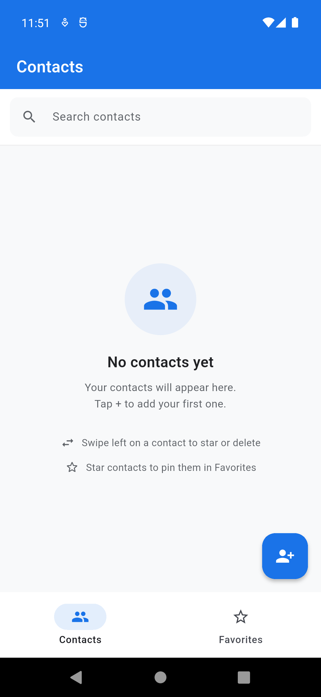
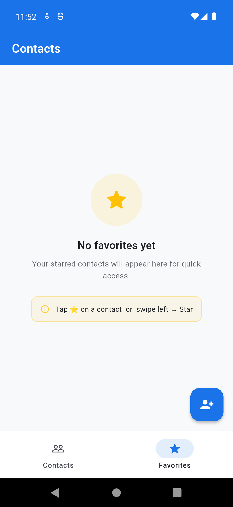
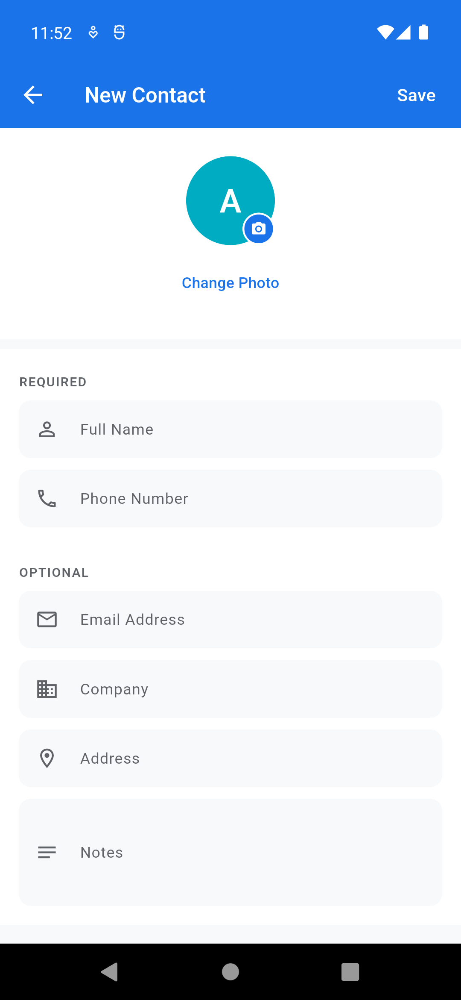
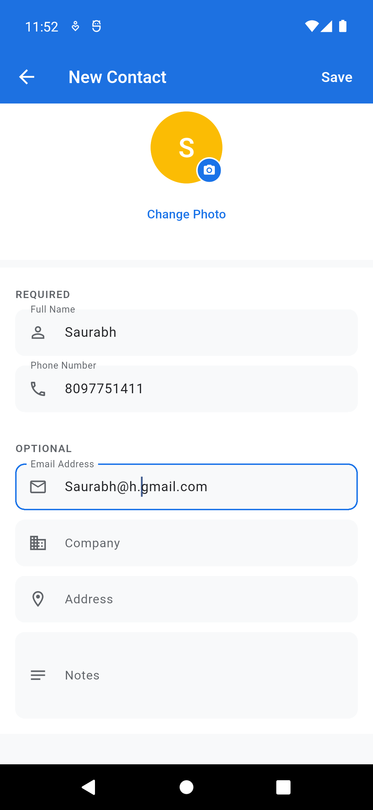
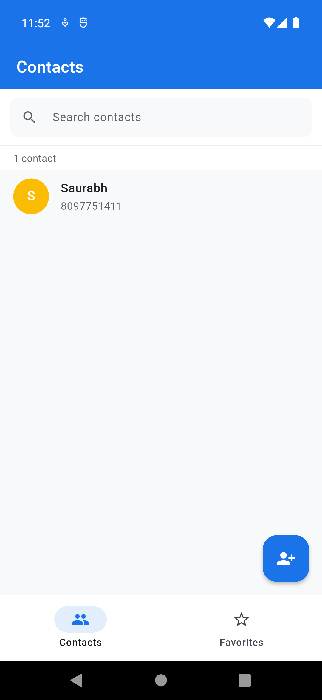
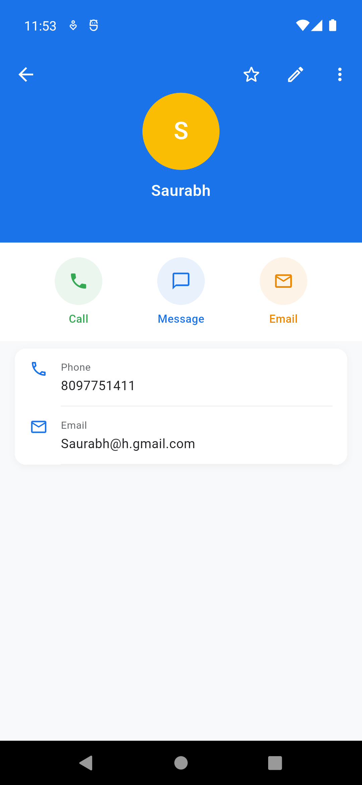
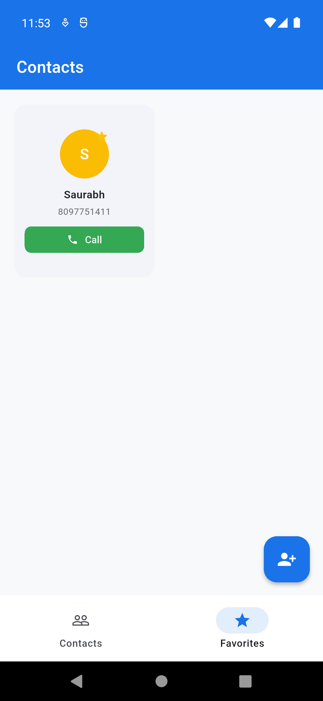
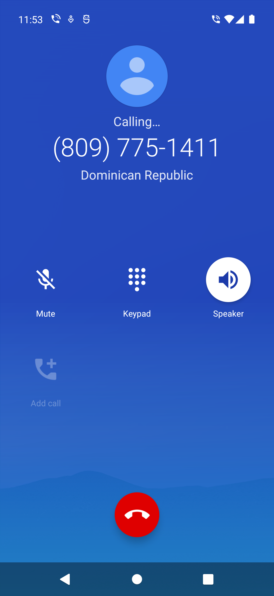

# Flutter Contacts App

A clean, fully-featured contacts manager built with Flutter and SQLite. Supports Android and iOS.

---

## Screenshots

<p float="left">
  
  
  
  
</p>
<p float="left">
  
  
  
  
</p>

---

## Features

- **Add / Edit / Delete contacts** — name, phone, email, company, address, notes, and photo
- **Favorites** — star any contact to pin it in the Favorites tab for quick access
- **Search** — real-time search by name, phone, or email
- **Swipe actions** — swipe left on a contact to star or delete
- **Contact detail** — full profile view with one-tap Call, Message, and Email actions
- **Validation** — phone (7–15 digits, ITU-T E.164) and email (RFC 5322) validation
- **Avatar** — auto-generated color initials; tap to pick a photo from gallery
- **Offline-first** — all data stored locally using SQLite (sqflite)

---

## Tech Stack

| Layer | Technology |
|-------|-----------|
| Framework | Flutter 3.x (Dart) |
| Database | SQLite via `sqflite` |
| UI | Material Design 3 |
| Image picker | `image_picker` |
| URL actions | `url_launcher` |
| Swipe actions | `flutter_slidable` |
| Permissions | `permission_handler` |

---

## Installation

### Prerequisites
- Flutter SDK `>=3.0.0`
- Android Studio / Xcode
- A connected Android/iOS device or emulator

### Steps

```bash
# 1. Clone the repository
git clone https://github.com/saurabhappdeveloper/flutter-contacts-app.git
cd flutter-contacts-app

# 2. Install dependencies
flutter pub get

# 3. Run on a connected device
flutter run
```

---

## Project Structure

```
lib/
├── main.dart                        # App entry point
├── database/
│   └── database_helper.dart         # SQLite CRUD operations
├── models/
│   └── contact.dart                 # Contact data model
├── screens/
│   ├── home_screen.dart             # Main scaffold with bottom nav
│   ├── contacts_tab.dart            # Contacts list + search
│   ├── favorites_tab.dart           # Starred contacts grid
│   ├── add_edit_contact_screen.dart # Add / edit form
│   └── contact_detail_screen.dart   # Full contact profile
├── utils/
│   ├── app_colors.dart              # Color constants
│   └── phone_utils.dart             # Call / SMS / Email actions
└── widgets/
    ├── contact_avatar.dart          # Avatar with initials fallback
    └── contact_list_tile.dart       # Swipeable list row
```

---

## Usage

| Action | How |
|--------|-----|
| Add contact | Tap the **+** button (bottom right) |
| Edit contact | Open contact → tap **edit** icon |
| Delete contact | Open contact → tap **⋮** → Delete, OR swipe left → Delete |
| Star contact | Open contact → tap **★**, OR swipe left → Star |
| View favorites | Tap the **Favorites** tab |
| Search | Type in the search bar on the Contacts tab |
| Call | Open contact → tap **Call** button |
| Message | Open contact → tap **Message** button |
| Email | Open contact → tap **Email** button |

---

## Permissions

| Permission | Platform | Purpose |
|-----------|----------|---------|
| `READ_PHONE_STATE`, `CALL_PHONE` | Android | Direct call without opening dialer |
| Photo library access | iOS | Pick contact photo from gallery |

---

## APK

📥 [`releases/flutter-contacts-app.apk`](releases/flutter-contacts-app.apk)

Works on **all Android devices** (ARM 32-bit, ARM 64-bit, x86).

**To install:**
1. Download the APK file to your Android device
2. Go to **Settings → Install unknown apps** and allow installation from your browser/file manager
3. Open the downloaded APK and tap **Install**

> Built with: `flutter build apk --release`
